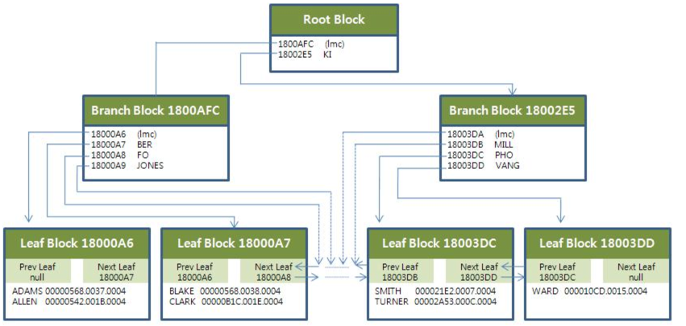
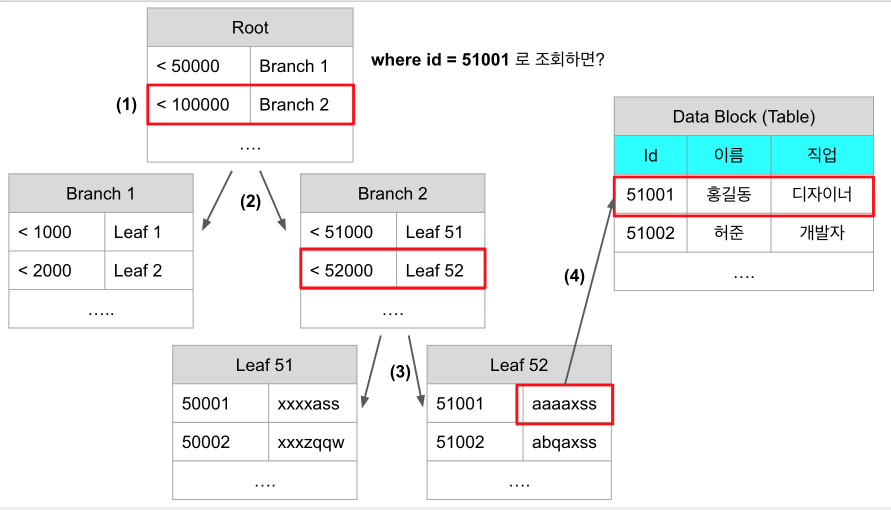

# 1주차

## 1. 인덱스의 구조

> 인덱스 == 정렬

인덱스는 크게 해시 인덱스와 B+Tree 인덱스가 있습니다.  
해시 인덱스는 키 값을 해시값으로 변경후, 해시값+값의 구조를 얘기합니다.  
해시계산의 경우 데이터 양에 의존하지 않기 때문에 데이터 양이 늘어도 계산량(```O(1)```)은 변경되지 않는다는 장점이 있습니다.  
하지만 아래와 같은 경우에 전혀 사용할 수 없습니다.  

* 가격이 10,000원 이하의 선물을 찾고 싶다.
* 제목이 "Final"로 시작하는 게임 리스트를 찾고 싶다.
* 최신순으로 정렬된 값을 찾고 싶다.

해시 인덱스의 이런 단점을 해결하고자 **B+Tree** 인덱스 구조가 있습니다.  

### B+Tree 인덱스



([출처 : 구루비 위키](http://wiki.gurubee.net/pages/viewpage.action?pageId=26739921))  

> Root Node와 Branch Node에 표기된 lmc는 Left Most Child를 뜻합니다.  
(Leaf Node에는 없습니다.)  
다른 Key들은 명시적으로 자식 노드를 가리키지만, lmc는 가장 작은 값을 의미하기 때문에 **자식 노드 중, 가장 왼쪽**을 의미합니다.  
  
인덱스는 3개의 Node 타입으로 분류됩니다.  

* Root Node (혹은 Root Block)
  * 최상위 노드
  * 하위의 브랜치 Node수만큼 Row를 가지고 있음 
* Branch Node (혹은 Branch Block)
  * Root와 Leaf의 연결고리
  * 자기 하위의 Leaf Node 수 만큼의 Row를 가지고 있음
  * 데이터가 적을 경우 Root Node + Leaf Node만 구성될 수 있음
  * 반대로 데이터가 많을 경우 Branch Node 아래에 Branch Node가 추가 될 수 있음
* Leaf Node (혹은 Leaf Block)
  * Key와 RowID로 구성
  * RowID : 해당 테이블 Row를 찾아가기 위한 주소정보
  * Key 순서대로 정렬되어있으며, 이전 이후의 Leaf Node Key를 갖고 있음
* Data Block
  * 위 이미지엔 없지만 Leaf Node의 RowId가 가리키는 **테이블 Row의 실제 저장소**를 얘기합니다.

위 내용을 좀 더 추상화시켜 보겠습니다.



id가 인덱스(유니크)로 잡혀있는 상황에서 id가 51001인 데이터를 찾는다고 가정 하겠습니다.  

1) 어느 Branch로 가야할지 Root에서 찾습니다.
2) Root에서 Branch2로 이동합니다. 
3) Branch2에서 Leaf2로 이동합니다.
4) Leaf2에서 실제 데이터 위치(RowId : ```aaaaxss```)로 이동

이렇게 총 4회만에 원하는 Row를 찾을 수 있습니다.  

## 2. 인덱스의 기본원리

인덱스가 컬럼에 지정되어 있어도 인덱스 사용이 안되거나 범위 Scan이 불가능한 경우가 있습니다.

### 인덱스 컬럼의 좌측을 수정한 검색조건

**Bad**

```sql
select *
from 업체
where substr(업체명, 1, 2) = '대한';
```

**Good**

```sql
select * 
from 업체
where 업체명 like '대한%';
```

**Bad**

```sql
select *
from 사원
where 월급여 * 12 = 5000;
```

**Good**

```sql
select *
from 사원
where 월급여 = 50000/12;
```

**Bad**

```sql
select *
from 고객
where 계약구분||년월||일련번호 = 'C1312001';
```

**Good**

```sql
select *
from 고객
where 계약구분 = 'C' and 년월 = '1312' and 일변번호 = '001';
```

> 컬럼의 값을 수정해서 검색하기 보다는 **컬럼값 그대로** 조건을 변경해야합니다.


### Null 검색

**Bad**

```sql
select *
from 고객
where 고객번호 is null;
```

> null은 인덱스가 걸리지 않습니다.  

### 자동 형변환

컬럼과 조건절의 비교값 타입이 다를 경우 컬럼의 값을 비교값의 타입으로 변환시켜 비교하게 됩니다.

```sql
select *
from 고객
where 고객번호 = 100
```

> 자동 형변환이 발생할 경우 형변환 된 것에 인덱스가 걸린것이 아니기 때문에 인덱스 Scan이 안됩니다.  
만약 변환이 불가능할 경우 에러가 발생합니다.

## 오라클의 실행계획 보는법

> 동일한 위치에선 위에서 아래로 실행되며, 그룹내 계층구조에선 가장 아래부터 시작합니다.

**ex 1)**

```
1 ======  
2 ======  
3 ======  
```  

실행순서 : 1 -> 2 -> 3 

> 동일한 위치로 1,2,3이 있으므로 위에서 아래로 실행됩니다.

**ex 2)**

```
1 ======  
2  =====  
3   ====  
```  

실행순서 : 3 -> 2 -> 1 

> 1,2,3이 한그룹의 계층구조로 되어 있으므로 가장 아래부터 실행됩니다.

**ex 3)**

```
1 ======  
2  =====  
3  =====  
```  

실행순서 : 2 -> 3 -> 1 

> 1 은 2, 3을 갖고 있으니 순서상 둘 보다 뒤로 밀리며 2,3은 동등한 위치이므로 둘 중 위에 선언된 2가 실행된 뒤 3이 실행되고 마지막으로 1이 실행됩니다. 

**ex 4)**

```
1 ======  
2  =====  
3  =====  
4   ====  
5    ===
```

실행순서 : 2 -> 5 -> 4 -> 3 -> 1

> 1 아래에 2 3이 동등한 위치에 있으므로 2가 먼저 실행되고 3은 아래에 4,5가 있습니다. 4는 역시 5를 아래에 두고 있기 때문에 5 -> 4 -> 3 실행후 마지막으로 1이 실행됩니다.

## 다양한 인덱스 Scan 방식

> 옵티마이저 힌트를 줘서 아래 인덱스 스캔 방식을 DBMS가 선택할 수 있도록 제시할 수 있습니다.

### 인덱스 Range Scan

* Range란 where의 ```between 조회```, 단일 건이 아닌 조회를 얘기합니다.  
* 인덱스가 조합된 형태라면 

인덱스 : 부서코드 + 이름  

**Bad**

```sql
select *
from 사원
where 이름 = '홍길동'
```

**Good**

```sql
select *
from 사원
where 부서코드 = '개발부'
```

### 인덱스 Full Scan

발생조건)

* Leaf 블록들간 링크들을 이용하여 정렬된 순서대로 모든 데이터를 읽어나가는 방식
* 조회 조건의 인덱스가 없을 경우
* 조회 조건의 인덱스가 있으나 변조한 경우
* 옵티마이저가 인덱스 활용시 이익이 있다고 판단할 경우 발생

> 조회 결과값이 많을 경우엔 Full Table Scan이 효율적입니다. 

### 인덱스 Unique Scan

* 유니크 인덱스이며 ```=``` 조건일 경우에 발생

### 인덱스 Skip Scan

* 조회 조건이 인덱스의 첫 컬럼이 아니며, 인덱스 첫 컬럼의 값의 종류가 매우 적을 경우 사용
  * ex) 성별 등
* 인덱스 첫 컬럼을 범위조회(```between, like```)의 조건으로 사용 가능

```sql
인덱스 : 성별 + 연봉

select 성별, 연봉
from 사원
where 연봉 > 7000 
```

### 인덱스 Fast Full Scan

* 정렬 순서는 무시한체 Multi Block I/O (뭉텅이로 가져옴)를 통해 읽어올리는 방식
* Index Full Scan보다 훨씬 빠른 속도로 동작하지만, 출력된 결과는 정렬이 안되어 있음
* 단, **인덱스에 포함된 컬럼으로만 조회**할 때 사용 가능
