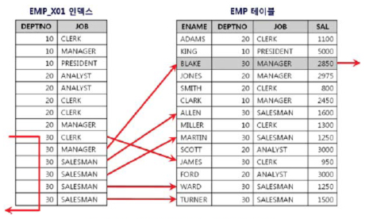
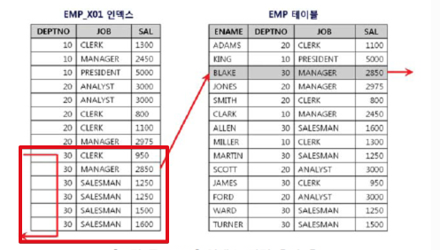

# 2주차

## 5. 테이블 Random Access 부하

* 인덱스를 쓰는 이유는 **RowId를 찾기 위함**  
* RowId는 HDD에 있음
* RowId를 해시 함수로 돌려

### Clustering Factor

테이블 블럭들이 **인덱스 정렬 순으로 얼마나 잘 정렬**되어있는지에 대한 지표 

## 6. 테이블 Random 액세스 최소화 튜닝

### 인덱스가 많을 때의 단점

* Command(명령 : 등록/수정/삭제)시 인덱스 변경이 필요하여 시간이 많이 소모
* 인덱스 저장 장소가 필요하여 저장소 용량이 많이 필요하게 됨
* 옵티마이저가 인덱스를 보고 실행계획을 작성하는데, 이때 인덱스가 많으면 많을수록 **옵티마이저는 잘못된 실행계획**을 생성할 확률이 높다.

> 인덱스는 3개 이하를 권장한다.  

### 인덱스 컬럼 추가로 해결하기

**문제상황)**

```sql
인덱스 : deptno + job

select *
from emp
where deptno = 30
and sal > 2000
```

위와 같은 쿼리를 실행하게 되면 ```sal > 2000```인 값을 인덱스를 통해 알 수 없으므로 아래와 같이 **deptno=30인 값들은 모두 테이블 랜덤 엑세스가 발생**하게 됩니다.  



이걸 해결하기 위해서 인덱스를 ```부서+sal``` 로 변경하면 좋겠지만, 이미 다른 곳에서 해당 인덱스를 통해 조회하고 있다면 어려울 것입니다.  
그래서 기존의 다른 조회 쿼리들의 성능을 저해하지 않으면서 개선하는 방법은 **인덱스 컬럼을 추가**하는 것입니다.

```sql
인덱스 : deptno + job + sal
```



이렇게 **인덱스 스캔은 전과 동일**하지만, **테이블 랜덤 엑세스를 효율**적으로 개선할 수 있게 되었습니다.


## 8. 인덱스 스캔 효율

* 수직적 탐색의 효율화
  * 가능한 방법은 인덱스 재생성
* 수평적 탐색의 선택도
  * 인덱스 매칭도를 높이는 것
* 테이블 랜덤 Access 최소화

위 3가지가 인덱스 개선의 방향

* 단일 컬럼으로 인덱스를 만들어야 한다면, Distinct가 높을수록(즉, 종류가 많을수록) 유리하다.

* between, 등호, like는 본인만 만족하는 조건이라 다음 조건은 다 깨져버린다.
* 반면에 =, in 은 다음 조건이 안깨지도록 한다.
* in은 범위 조회가 아닌가?
  * 해당 값 찾고 바로 다시 수직적 탐색을 시작하니
  * But, in의 값이 많으면 많을수록 비효율이라 Between과 비교가 필요함
  * 인덱스를 안태우도록 좌변을 가공하면 인덱스가 안타 수직적 탐색이 발생하지 않아 오히려 비효율이 개선된다.(ex: ```trim(컬럼)```) 

```sql
select *
from t
where c1 in ('A', 'K')
```

```sql
select *
from t
where c1 = 'A'
union all
select
from 
where c1 = 'K'
```

> 중요한건 연산자다  

* 인 : 인덱스 매칭도
* BI : Between, In List 
* 스 : 스킵 스캔
* 범 : 
* 같 : 
* B :
* 선 : 


### 추천 도서

* 오라클 성능 고도화 원리와 해법 (2권부터 읽기를 추천)
* SQL 전문가 가이드