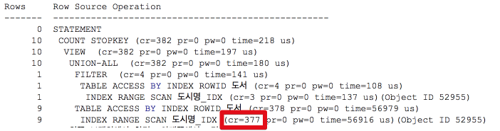
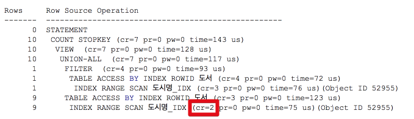
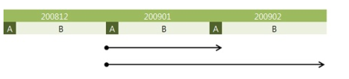
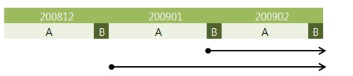
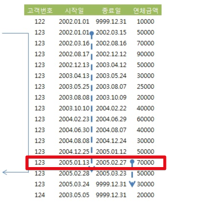
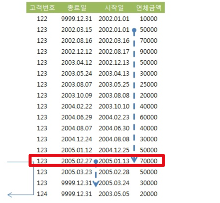

# 3주차

### 8. (4) Index Skip Scan을 이용한 비효율 해소

Index Skip Scan을 통해 인덱스를 좀 더 효율적으로 사용하는 경우와 방법을 진행해보겠습니다.  
  
고객번호, 판매월, 판매구분, 판매금액으로 이루어진 ```월별고객판매집계``` 테이블이 있다고 가정합니다.  
이때 판매구분 + 판매월을 기준으로 조회해야 할때 어떻게 개선할 수 있을지 확인해보겠습니다.

#### 케이스1. 인덱스: 판매구분 + 판매월

인덱스를 판매구분 + 판매월로 잡아 수행해보겠습니다.

```sql
인덱스 : 판매구분 + 판매월

select count(*)
from 월별고객판매집계 t
where 판매구분 = 'A'
and 판매월 between 200801 and 200812
```

실행계획을 수행해보면 ConsistencyRead(LogicalRead)는 **281**이 나옵니다..  
만약 ```판매월 + 판매구분```으로 인덱스가 잡혀있다면 어떻게될까요?

#### 케이스2. 인덱스: 판매월 + 판매구분

```sql
인덱스 : 판매월 + 판매구분

select count(*)
from 월별고객판매집계 t
where 판매구분 = 'A'
and 판매월 between 200801 and 200812
```

케이스 1과 동일하게 조건을 사용하게 되면 ConsistencyRead는 **3090**이 나옵니다.  
즉, 앞의 1~2주차에 했던것과 동일하게 **between이 먼저 인덱스 조건이 되어 뒤의 판매구분이 전혀 인덱스 효과를 발휘하지 못하고** 케이스1에 비해 굉장히 비효율적인 인덱스가 됩니다.  

자 그럼 ```판매구분 + 판매월```로 인덱스를 변경하면 될까요?  
실제 운영 환경에서 인덱스를 변경하는 일은 굉장히 부담됩니다.  
왜냐하면 해당 테이블의 인덱스를 다시 생성해야하는데 이 시간동안 해당 테이블에 등록/수정/삭제는 부담이 되기 때문입니다.  
보통 **한번 만든 인덱스는 거의 변경하지 않거나, 가장 사용율이 적은 시간때에 수정하는 등 최대한 자제**하는 편입니다.  
그럼 이렇게 이미 ```판매월 + 판매구분```으로 지정된 상태에서 어떻게 인덱스 효율을 높일지 확인해보겠습니다.

#### 케이스3. 인덱스: 판매월 + 판매구분, in list

```sql
인덱스 : 판매월 + 판매구분

select count(*)
from 월별고객판매집계 t
where 판매구분 = 'A'
and 판매월 in ('200801','200802','200803','200804','200805','200806','200807','200808','200808','200810','200811','200812');
```

between의 비효율은 이미 알고 있습니다.  
이를 개선하기 위한 첫번째 방법으로 **in list를 사용**하는 것입니다.  
  
in은 **union all+equal(=)을 여러개 연결한것과 동일**합니다.  
즉, 각 판매월을 = 조건으로 각각 조회하고 이 결과를 합친것이기 때문에 인덱스 효과를 볼수 있습니다.  
  
이 쿼리의 결과는 ConsistencyRead가 **314**가 됩니다.  
between의 결과가 3090인것에 비하면 약 10배가 향상된것을 확인할 수 있습니다.  

#### 케이스4. 인덱스: 판매월 + 판매구분, Skip Scan

```sql
인덱스 : 판매월 + 판매구분

select /*INDEX_SS (t 월별고객별판매집계_IDX2) */ count(*)
from 월별고객판매집계 t
where 판매구분 = 'A'
and 판매월 between 200801 and 200812
```

케이스2의 쿼리와 다른것으로, 옵티마이저 힌트로 SkipScan을 제공 (```/*INDEX_SS (t 월별고객별판매집계_IDX2) */```)한것입니다.  
이경우 인덱스는 불필요한 부분을 Skip 하며 스캔을 하게 됩니다.


(Index Skip Scan 진행방향)  
  
불필요한 부분을 읽지 않기 때문에 비효율이 많이 개선됩니다.  
이 쿼리의 ConsistencyRead는 **300**이 됩니다.

#### 결론

|   구분  | 인덱스 변경 | Between | In List | Skip Scan |
|:-------:|:-----------:|:-------:|:-------:|:---------:|
| 블록 IO |     281     |   3090  |   314   |    300    |

* 판매월의 distinct가 낮을 수록 in-list가 between 보다 유리하다.
  * 즉, 중복된 값이 많을수록 in list 효율은 증가한다.
* 인덱스의 수직적 탐색 (root에서부터 leaf까지의 탐색)이 많은 in-list 보다는 Index Skip Scan이 **근소하게 유리** 

### 8. (5) 범위검색 조건을 남용할 때 발생하는 비효율

회사, 지역, 상품명을 입력하여 '가입상품' 테이블에서 데이터를 조회하는 프로그램를 만든다고 가정해보겠습니다.  
조건은 다음과 같습니다.

1. 회사는 반드시 입력
2. 지역은 입력하지 않을 수도 있다.
3. 상품명은 단어 중 일부만 입력하고도 조회 가능

인덱스는 ```회사 + 지역 + 상품명```으로 잡혀있습니다.  
위 조건을 만족하기 위해서 보통은 쿼리를 2개로 나눠서 생성합니다.  
  
**지역조건이 있을 경우**

```sql
SELECT *
FROM  가입상품
WHERE 회사 = :com
AND   지역 = :reg
AND   상품명 LIKE :prod || '%'
```

**지역조건이 없을 경우**

```sql
SELECT ....
FROM  가입상품
WHERE 회사 = :com
AND   상품명 LIKE :prod || '%'
```

이 쿼리들의 인덱스 스캔 범위는 아래와 같습니다.  


(출처: [구루비](http://wiki.gurubee.net/pages/viewpage.action?pageId=26740302))  
  
지역조건이 있는 쿼리와 없는 쿼리는 인덱스 스캔 범위가 확연히 차이가 납니다.  
개발을 하다보면 이렇게 유사한 쿼리를 1개의 쿼리로 수행하려고 작성할때가 종종 있습니다.  
만약 1개의 쿼리로 작성할때 아래와 같이 한다면 어떨까요?

```sql
SELECT *
FROM  가입상품
WHERE 회사 = :com
AND   지역 LIKE :reg || '%'
AND   상품명 LIKE :prod || '%'
```

이렇게 한방쿼리를 작성했을때 인덱스 탐색 범위는 아래와 같습니다.


(출처: [구루비](http://wiki.gurubee.net/pages/viewpage.action?pageId=26740302))  

한방쿼리를 작성하니 오히려 지역조건이 있을때도 비효율이 발생하게 됩니다.  
이럴 경우 좋은 방안이 있습니다.  
```union all```을 사용하는 것입니다.

```sql

where :reg is not null
and 회사 = :com
and 지역 = :reg
and 상품명 like :prod

union all
where :reg is null
and 회사 = :com
and 상품명 like :prod  

```

물론 지역조건이 없을 경우에는 여전히 비효율이 있지만, 지역조건이 있을때는 효율적으로 인덱스를 탐색하고 1개의 쿼리로 모든 대응을 할 수 있게 됩니다. 

### 8. (6) 같은 컬럼에 두 개의 범위검색 조건 사용시 주의 사항

도서 조회용 프로그램을 개발한다고 가정하겠습니다.  
'오라클'을 키워드로 입력하면, '오라클'로 시작하는 모든 도서가 조회되는 기능이 필요하며 한 화면에는 10개씩 출력해야 합니다.  
현재 작성된 쿼리는 아래와 같습니다.

```sql

select *
from (
  select rownum rnum, 도서번호, 도서명, 가격, 저자, 출판사, isbn
  from (
    select 도서번호, 도서명, 가격, 저자, 출판사, isbn
    from   도서
    where  도서명 like :book_nm || '%'
    order by 도서명
  )
  where rownum <= 100
)
where rnum >= 91

```

위 쿼리는 앞 페이지는 문제가 없지만, **뒤로 갈수록 성능이 늦어지는 문제**를 안고 있습니다.  
만약 이 상황에서 뒤쪽 어느 페이지로 이동하더라도 빠르게 조회되도록 구현해야 한다면 어떻게 쿼리를 작성해야 할까요?

```sql

select *
from (
    ----- 이전조회와 도서명이 같은 경우
    select /*+ index(도서 도시명_idx) */
           rowid rid, 도서번호, 도서명, 가격, 저자, 출판사, isbn
    from   도서
    where  도서명 like :book_nm || '%'
    and    도서명 = :last_book_nm    -- 이전 페이지에서 출력된 마지막 도서명
    and    rowid  > :last_rid        -- 이전 페이지에서 출력된 마지막 도서의 rowid
    union all  ---- 이전 조회보다 도서명이 큰 경우
    select /*+ index(도서 도시명_idx) */
           rowid rid, 도서번호, 도서명, 가격, 저자, 출판사, isbn
    from   도서
    where  도서명 like :book_nm || '%'
    and    도서명 > :last_book_nm    -- 이전 페이지에서 출력된 마지막 도서명
)
where rownum <= 10;
```

읽은 곳 바로 뒤를 읽는 패턴으로 작성된 쿼리입니다.  
이 쿼리의 실행계획을 보시면



아래쪽 인덱스 스캔단계에서 377 블록을 읽었습니다.  
바로 위에 보시면 동일한 RANGE Scan에서 3 블록을 읽은것을 확인하실 수 있습니다.  
이렇게 인덱스 스캔이 발생한 이유는 ```union all```쿼리의 조건에 있는 ```도서명 like :book_nm || '%'```을 인덱스 조건으로 사용되었기 때문입니다.  
즉, ```도서명%```로 된 도서를 처음부터 스캔하다가 last_book_nm보다 큰 9개 row를 찾으면 스캔을 멈추게 됩니다.  
뒤 페이지를 찾으려 할수록 last_book_nm보다 큰 9개 row를 찾는것에 많은 시간이 필요하게 됩니다.  
  
이 쿼리를 개선하기 위해선 1번째 조건인 like를 인덱스 조건으로 사용하는것이 아닌, > 조건을 인덱스 조건으로 사용하도록 변경하는 것입니다.  
인덱스를 못태우도록 ```도서명 like``` 조건을 아래와 같이 변경합니다.

```sql
    union all
    select /*+ index(도서 도시명_idx) */
           rowid rid, 도서번호, 도서명, 가격, 저자, 출판사, isbn
    from   도서
    where  trim(도서명) like :book_nm || '%'
    and    도서명 > :last_book_nm
```

trim을 통해 컬럼값을 가공하여 인덱스를 안타도록 강제하였습니다.  
이렇게 되면 > 조건을 인덱스의 조건으로 사용하게 됩니다.  



인덱스를 탔기 때문에 RangeScan의 효율도 상승하였습니다.

### 8. (7) between과 like 스캔 범위 비교

일반적으로 Between을 사용하는것이 정확한 방식이나, 가끔 편리에 의해 like를 사용하는 경우를 보게 됩니다.  
(여기서 한가지 Tip이 있다면 Between을 사용하면 성능적으로 손해볼것이 없습니다.)  
  
#### 예제1. A가 10%, B가 90%인 경우

대략 A가 전체의 10%, B가 90%일 경우 between과 like의 스캔 범위는 아래와 같습니다.



(출처: [구루비](http://wiki.gurubee.net/pages/viewpage.action?pageId=26740302))  
  
첫번째 줄은 between을 나타내며, 두번째 줄은 like를 나타냅니다.

1. between은 **시작점과 끝점에선 equals(=)와 같은 효과**를 발휘합니다.
2. like는 조건 그 이상을 검색하게 됩니다.
* 예를 들어 ```like 200902%```로 검색하면 실제 데이터가 200901, 200902 등 6자리로만 구성되어 있어도 20090201, 20090202 등의 데이터가 있는지 DB에선 알수 없으므로 200902로 되어 있는 모든 데이터를 스캔하게 됩니다.  
  
실제 쿼리를 보고 비교해보겠습니다.

```sql

<쿼리 1>
select count(*)
from  월별고객별판매집계
where 판매월 between '200901' and '200902'
and   판매구분 = 'A';

<쿼리 2>
select count(*)
from  월별고객별판매집계
where 판매월 like '2009%'
and   판매구분 = 'A';

<쿼리 3>
select count(*)
from  월별고객별판매집계
where 판매월 >= '200901'
and   판매월 < '200903'
and   판매구분 = 'A';

```

1. 쿼리 1 : 2009년 1월 데이터는 모두, **2009년 2월 데이터는 판매구분이 'A'인 데이터만** 읽는다.
2. 쿼리 2 : 2009년 1월과 **2월 데이터를 모두** 읽는다.
3. 쿼리 3 : '200902' || 'A' 구간만 읽고서 멈추지 못해 결국 **like 쿼리와 같은** 스캔량을 보인다.  
  
#### 예제2. A가 90%, B가 10%인 경우

반대로 A가 90%, B가 10%인 경우를 보겠습니다.



(출처: [구루비](http://wiki.gurubee.net/pages/viewpage.action?pageId=26740302))  
  
여기서 아래와 같이 쿼리를 실행해보겠습니다.

```sql

<쿼리 4>
select count(*)
from  월별고객별판매집계
where 판매월 between '200901' and '200902'
and   판매구분 = 'B';

<쿼리 5>
select count(*)
from  월별고객별판매집계
where 판매월 like '2009%'
and   판매구분 = 'B';

<쿼리 6>
select count(*)
from  월별고객별판매집계
where 판매월 between '200900' and '200902'
and   판매구분 = 'B'; 

<쿼리 7>
select count(*)
from  월별고객별판매집계
where 판매월 like '200901%'
and   판매구분 = 'B';

```

4. 쿼리 4 : 2009년 2월 데이터는 모두 읽더라도 **1월 데이터는 판매구분이 'B'인 값만** 읽는다.
5. 쿼리 5 : 2009년 1월과 2월 데이터 모두 읽는다. 1월 데이터를 모두 스캔하는 이유는 '2009'으로 조회 했기 때문.
6. 쿼리 6 : 쿼리 5와 스캔량은 같다. between이라고 하더라도 쿼리 시작값을 '200900'으로 입력하고 조회하면 LIKE와 스캔량이 같음
7. 쿼리 7 : like지만, 인덱스에서 실제 찾아지는 값을 입력하면 스캔 범위를 줄일 수 있음

#### 결론

범위 검색은 like, <> 보다 Between이 절대 손해볼일이 없음을 확인할 수 있었습니다.

### 8. (8) 선분이력의 인덱스 스캔 효율

#### 선분이력이란?

시작시점과 종료시점을 관리하는 것을 얘기합니다.  
예를 들어 ```start_date```, ```end_date``` 2개의 컬럼을 추가하여 테이블엣 관리되고 있는것을 얘기합니다.  
여기서 얘기하려고 하는 인덱스 스캔 효율이란, 항상 두 개의 부등호 조건을 함께 사용하는 선분이력에선 **두 번째 부등호 조건이 스캔 범위를 줄이는 데 전혀 도움을 주지 못해** 비효율이 발생하는 현상을 얘기합니다.  
(범위 조건의 다음 인덱스 조건은 인덱스를 못타는 이슈 때문입니다.)  

#### 예제1. 최근 시점 조회

예를 들어 고객번호가 123이며 20050131일의 연체금액을 조회한다고 가정해보겠습니다.

```sql

인덱스 : 고객번호 + 시작일 + 종료일

select * 
from  고객별연체금액
where 고객번호 = '123'
and   '20050131' between 시작일 and 종료일;

--- 혹은

select * 
from  고객별연체금액
where 고객번호 = '123'
and   시작일 <= '20050131' 
and   종료일 >= '20050131';

```

위 쿼리의 인덱스 스캔 범위는 아래와 같습니다.



* '=' 조건인 고객번호 다음 인덱스 **컬럼(시작일)이 '<=' 조건**이므로 2005년 1월 31일 이전의 많은 이력 레코드를 모두 스캔.
* 종료일 조건은 시작일 보다 훨씬 적은 범위지만 **선두 컬럼(시작일)이 부등호 조건이기 때문에 스캔 범위를 줄이는데 기여하지 못한다**.
* 종료일이 인덱스 컬럼에 포함되 있기 때문에 테이블 Random 액세스 없이 필터링.
* 최종 레코드는 한 건이지만 많은 인덱스 레코드를 스캔하는 문제가 있다.

이런 경우엔 쿼리를 아래와 같이 개선할 수 있습니다.

```sql

select /*+ index_desc(a idx_x01) */ * 
from  고객별연체금액
where 고객번호 = '123'
and   '20050131' between 시작일 and 종료일
and   rownum <= 1;

```

즉, 인덱스 스캔 시작을 desc순으로 하고 rownum을 1로 제한하여 

#### 예제2. 과거 시점 조회

```sql

인덱스 : 고객번호 + 종료일 + 시작일

select * 
from  고객별연체금액
where 고객번호 = '123'
and   '20050131' between 시작일 and 종료일;

---- 혹은

select * 
from  고객별연체금액
where 고객번호 = '123'
and   시작일 <= '20050131' 
and   종료일 >= '20050131';

```

위 쿼리의 인덱스 스캔 범위는 아래와 같습니다.



* '=' 조건인 고객번호 다음 인덱스 컬럼(종료일)이 '<=' 조건이므로 2002년 9월 30일 이후의 많은 이력 레코드를 모두 스캔
* 스캔량해야 할 범위가 아무리 넓더라도 rownum <= 1 조건을 추가하여 개선.

```sql

select * 
from  고객별연체금액
where 고객번호 = '123'
and   '20050131' between 시작일 and 종료일
and   rownum <= 1;

```

#### 결론

결론적으로 아래와 같이 인덱스 규칙을 정하면 효율적으로 사용됨을 확인할 수 있었습니다.

* 최근 데이터를 주로 읽을때: 종료일자+시작일자 
* 과거 데이터를 주로 읽을때: 시작일자+종료일자
* 인덱스 수정이 불가능할 경우: Index_Desc 힌트 
* 중간 데이터를 주로 읽을때: 어떤 인덱스든 비효율이 발생하지만 ```rownum<=1``` 조건 활용

## 과제

과제와 관련된 자료가 오라클을 기준으로 되어있기 때문에 오라클을 설치해야만 가능하다.  
오라클 11g 부터는 맥이 지원안되기 때문에 아래를 참고해서 과제 환경을 구축하자.

* [맥북에서 오라클 사용하기](http://jojoldu.tistory.com/169)


