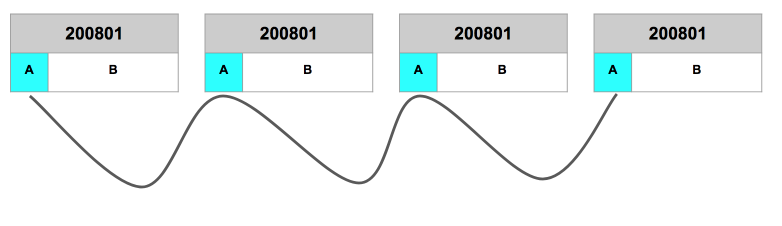
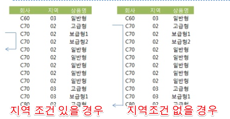
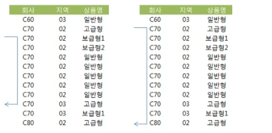

# 3주차

### 8. (4) Index Skip Scan을 이용한 비효율 해소

Index Skip Scan을 통해 인덱스를 좀 더 효율적으로 사용하는 경우와 방법을 진행해보겠습니다.  
  
고객번호, 판매월, 판매구분, 판매금액으로 이루어진 ```월별고객판매집계``` 테이블이 있다고 가정합니다.  
이때 판매구분 + 판매월을 기준으로 조회해야 할때 어떻게 개선할 수 있을지 확인해보겠습니다.

#### 케이스1. 인덱스: 판매구분 + 판매월

인덱스를 판매구분 + 판매월로 잡아 수행해보겠습니다.

```sql
인덱스 : 판매구분 + 판매월

select count(*)
from 월별고객판매집계 t
where 판매구분 = 'A'
and 판매월 between 200801 and 200812
```

실행계획을 수행해보면 ConsistencyRead(LogicalRead)는 **281**이 나옵니다..  
만약 ```판매월 + 판매구분```으로 인덱스가 잡혀있다면 어떻게될까요?

#### 케이스2. 인덱스: 판매월 + 판매구분

```sql
인덱스 : 판매월 + 판매구분

select count(*)
from 월별고객판매집계 t
where 판매구분 = 'A'
and 판매월 between 200801 and 200812
```

케이스 1과 동일하게 조건을 사용하게 되면 ConsistencyRead는 **3090**이 나옵니다.  
즉, 앞의 1~2주차에 했던것과 동일하게 **between이 먼저 인덱스 조건이 되어 뒤의 판매구분이 전혀 인덱스 효과를 발휘하지 못하고** 케이스1에 비해 굉장히 비효율적인 인덱스가 됩니다.  

자 그럼 ```판매구분 + 판매월```로 인덱스를 변경하면 될까요?  
실제 운영 환경에서 인덱스를 변경하는 일은 굉장히 부담됩니다.  
왜냐하면 해당 테이블의 인덱스를 다시 생성해야하는데 이 시간동안 해당 테이블에 등록/수정/삭제는 부담이 되기 때문입니다.  
보통 **한번 만든 인덱스는 거의 변경하지 않거나, 가장 사용율이 적은 시간때에 수정하는 등 최대한 자제**하는 편입니다.  
그럼 이렇게 이미 ```판매월 + 판매구분```으로 지정된 상태에서 어떻게 인덱스 효율을 높일지 확인해보겠습니다.

#### 케이스3. 인덱스: 판매월 + 판매구분, in list

```sql
인덱스 : 판매월 + 판매구분

select count(*)
from 월별고객판매집계 t
where 판매구분 = 'A'
and 판매월 in ('200801','200802','200803','200804','200805','200806','200807','200808','200808','200810','200811','200812');
```

between의 비효율은 이미 알고 있습니다.  
이를 개선하기 위한 첫번째 방법으로 **in list를 사용**하는 것입니다.  
  
in은 **union all+equal(=)을 여러개 연결한것과 동일**합니다.  
즉, 각 판매월을 = 조건으로 각각 조회하고 이 결과를 합친것이기 때문에 인덱스 효과를 볼수 있습니다.  
  
이 쿼리의 결과는 ConsistencyRead가 **314**가 됩니다.  
between의 결과가 3090인것에 비하면 약 10배가 향상된것을 확인할 수 있습니다.  

#### 케이스4. 인덱스: 판매월 + 판매구분, Skip Scan

```sql
인덱스 : 판매월 + 판매구분

select /*INDEX_SS (t 월별고객별판매집계_IDX2) */ count(*)
from 월별고객판매집계 t
where 판매구분 = 'A'
and 판매월 between 200801 and 200812
```

케이스2의 쿼리와 다른것으로, 옵티마이저 힌트로 SkipScan을 제공 (```/*INDEX_SS (t 월별고객별판매집계_IDX2) */```)한것입니다.  
이경우 인덱스는 불필요한 부분을 Skip 하며 스캔을 하게 됩니다.



(Index Skip Scan 진행방향)  
  
불필요한 부분을 읽지 않기 때문에 비효율이 많이 개선됩니다.  
이 쿼리의 ConsistencyRead는 **300**이 됩니다.

#### 결론

|   구분  | 인덱스 변경 | Between | In List | Skip Scan |
|:-------:|:-----------:|:-------:|:-------:|:---------:|
| 블록 IO |     281     |   3090  |   314   |    300    |

* 판매월의 distinct가 낮을 수록 in-list가 between 보다 유리하다.
  * 즉, 중복된 값이 많을수록 in list 효율은 증가한다.
* 인덱스의 수직적 탐색 (root에서부터 leaf까지의 탐색)이 많은 in-list 보다는 Index Skip Scan이 **근소하게 유리** 

### 8. (5) 범위검색 조건을 남용할 때 발생하는 비효율

회사, 지역, 상품명을 입력하여 '가입상품' 테이블에서 데이터를 조회하는 프로그램를 만든다고 가정해보겠습니다.  
조건은 다음과 같습니다.

1. 회사는 반드시 입력
2. 지역은 입력하지 않을 수도 있다.
3. 상품명은 단어 중 일부만 입력하고도 조회 가능

인덱스는 ```회사 + 지역 + 상품명```으로 잡혀있습니다.  
위 조건을 만족하기 위해서 보통은 쿼리를 2개로 나눠서 생성합니다.  
  
**지역조건이 있을 경우**

```sql
SELECT *
FROM  가입상품
WHERE 회사 = :com
AND   지역 = :reg
AND   상품명 LIKE :prod || '%'
```

**지역조건이 없을 경우**

```sql
SELECT ....
FROM  가입상품
WHERE 회사 = :com
AND   상품명 LIKE :prod || '%'
```

이 쿼리들의 인덱스 스캔 범위는 아래와 같습니다.  



(출처: [구루비](http://wiki.gurubee.net/pages/viewpage.action?pageId=26740302))  
  
지역조건이 있는 쿼리와 없는 쿼리는 인덱스 스캔 범위가 확연히 차이가 납니다.  
개발을 하다보면 이렇게 유사한 쿼리를 1개의 쿼리로 수행하려고 작성할때가 종종 있습니다.  
만약 1개의 쿼리로 작성할때 아래와 같이 한다면 어떨까요?

```sql
SELECT *
FROM  가입상품
WHERE 회사 = :com
AND   지역 LIKE :reg || '%'
AND   상품명 LIKE :prod || '%'
```

이렇게 한방쿼리를 작성했을때 인덱스 탐색 범위는 아래와 같습니다.



(출처: [구루비](http://wiki.gurubee.net/pages/viewpage.action?pageId=26740302))  

한방쿼리를 작성하니 오히려 지역조건이 있을때도 비효율이 발생하게 됩니다.  
이럴 경우 좋은 방안이 있습니다.  
```union all```을 사용하는 것입니다.

```sql

where :reg is not null
and 회사 = :com
and 지역 = :reg
and 상품명 like :prod

union all
where :reg is null
and 회사 = :com
and 상품명 like :prod  

```

물론 지역조건이 없을 경우에는 여전히 비효율이 있지만, 지역조건이 있을때는 효율적으로 인덱스를 탐색하고 1개의 쿼리로 모든 대응을 할 수 있게 됩니다. 

### 8. (6) 같은 컬럼에 두 개의 범위검색 조건 사용시 주의 사항


## 과제

과제와 관련된 자료가 오라클을 기준으로 되어있기 때문에 오라클을 설치해야만 가능하다.  
오라클 11g 부터는 맥이 지원안되기 때문에 아래를 참고해서 과제 환경을 구축하자.

* [맥북에서 오라클 사용하기](http://jojoldu.tistory.com/169)


