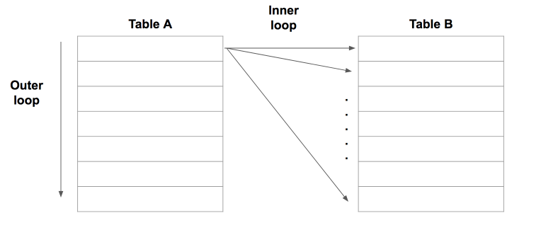
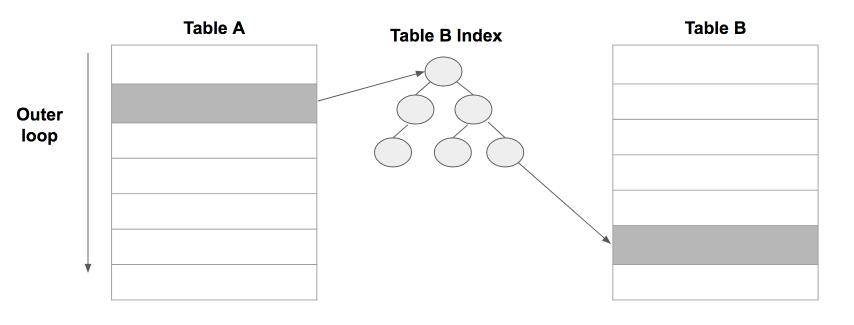

# 4주차 - 제 3장 조인의 기본 원리와 활용

## 조인 알고리즘

오라클은 아래의 3개 조인 알고리즘을 모두 지원하지만 **MySQL에서는 NestedLoop조인만 지원**합니다.

### 1. Nested Loop 조인

이름 그대로 **중첩반복을 사용**하는 조인 알고리즘입니다.  



(출처: [SQL 레벨업](http://www.hanbit.co.kr/store/books/look.php?p_code=B4250257160))

위 그림을 참고하여 Nested Loop 조인의 실행순서는 아래와 같습니다.

1. Table A에서 row를 하나씩 반복해가며 스캔합니다.  
이 테이블을 **Driving Table** 혹은 **Outer Table**이라 합니다.  
반대로 Table B (반대편)는 Inner Table이라 합니다.  

2. Driving Table의 row 하나마다 내부 테이블의 레코드를 하나씩 스캔해서 Join 조건에 맞으면 리턴합니다.

3. 1~2를 Driving Table의 모든 row에 반복합니다.

Nested Loop의 실행시간은 다음의 조건을 따릅니다. 

```
  Table A의 결과 Row * Table B의 결과 Row = Nested Loop의 실행 시간
=> R(A) * R(B) = 실행시간 
 = R(B) * R(A)  
```

여기서 재밌는 사실을 알 수 있습니다.  
Driving Table이 무엇이 되었든 조회결과는 R(A) * R(B), R(B) * R(A)이므로 변하지 않습니다.  
그런데 우리는 **Driving Table은 작은걸 선택해야 성능이 좋아진다**는 이야기를 많이 들었습니다.  
이 이야기에는 1개지 대전제가 있습니다.  
바로, **"Inner Table의 조인 키는 인덱스가 있어야 한다"** 입니다.  



일반적으로 조인은 FK를 통해 이루어지므로 위 대전제를 신경쓰지 않고 수행할때가 많습니다.  
반대로 Fk를 비롯한 인덱스가 전혀 없는 컬럼을 통해 조인을 실행하면 Driving Table이 어떤것이 되었든 실행시간은 비효율적으로 나타납니다.  
  
꼭 숙지해야할 내용은 이 한줄인것 같습니다.  
  
**Row가 적은 Driving Table  + Inner Table의 조인키에는 인덱스**

### 5. Outer 조인

```(+)```의 **반대쪽이 Driving Table**  
(즉, ```(+)```가 선언된 테이블의 반대편에 있는 Row들중 조건에 맞는 것들은 모두 출력되는 조인)  

> 오라클 외에 다른 DB에선 ```LEFT OUTER JOIN```, ```RIGHT OUTER JOIN``` 등으로 Driving Table을 지정할 수 있습니다.

예를 들어, **전체사원의 부서정보를 조회**한다고 가정하겠습니다.  
단, **부서가 없는 사원도 조회**되야 합니다.  
Inner Join으로 하게 되면 부서가 없는 사원은 조회되지 않습니다.  
이럴때 Outer Join을 쓰기 좋은 사례입니다.  
쿼리는 아래와 같습니다.

```sql

select e.id id, e.name name, d.id dept_id, d.name dept_name
from employee e LEFT OUTER JOIN department d
ON e.dept_id = d.id;

```

```employee e LEFT OUTER JOIN department d```으로 Driving Table을 employee로 지정하였습니다.  
위 쿼리의 결과는 아래와 같습니다.


| id |  name  | dept_id | dept_name |
|:--:|:------:|:-------:|:---------:|
| 1  | 홍길동 |    1    |   경리부  |
| 2  |  허준  |    2    |   총무부  |
| 3  | 이순신 |    3    |   보안팀  |
| 4  |  권율  |   null  |    null   |

### 6. 스칼라 서브쿼리를 이용한 조인

스칼라 서브쿼리는 수행회수 최소화를 위한 캐싱 기능

### 7. 조인을 내포한 DML 튜닝

> 개인적으로 ORM을 사용함으로써 위와 같은 방식은 사용할일이 전혀  없을것 같습니다.  
작은 성능 향상을 위해 도메인의 책임과 유지보수성을 완전히 버리게 되는거라 생각합니다.


