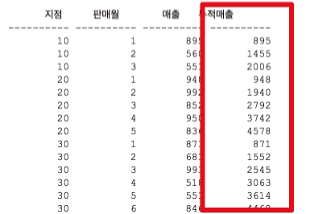

# 5주차 - 고급 조인 테크닉

여러 상황에서 효율적으로 조인을 사용하는 방법을 알아보겠습니다.

## 1. 누적매출 구하기

아래와 같은 형태의 테이블이 있다고 가정하겠습니다.


(출처 : [구루비](http://wiki.gurubee.net/pages/viewpage.action?pageId=26740935))  
  
이 테이블의 데이터에 전체매출 데이터를 포함해서 조회하고 싶습니다.



(이렇게 누적 매출이 추가되고 싶습니다.)  
  
오라클이라면 분석함수를 이용해서 해결할 수 있습니다.

```sql

select 지점, 판매월, 매출, 
        sum(매출) over(partition by 지점 order by 판매월
                    range between unbounded preceding and current row) 누적매출
from 월별지점매출
```

```partition by```는 Group by에서 집합을 뺀 기능이라고 보시면 됩니다.  
즉, 지점 단위로 잘라내기만 한 것입니다.  
  
```unbounded preceding```는 현재 윈도우의 시작 위치가 첫번째 row로 지정한 것입니다.  
  
```current row```를 통해 현재 row를 계속 가리키게 되어 row가 증가함에 따라 각 지점별/판매월의 누적 매출이 연산 됩니다.  
  
MySQL처럼 분석함수가 없다면 아래와 같이 group by로 해결할 수 있습니다.

```sql

select t1.지점, t1.판매월, min(t1.매출) as 매출, sum(t2.매출) as 누적매출
from   월별지점매출 t1, 월별지점매출 t2
where  t2.지점 = t1.지점
and    t2.판매월 <= t1.판매월
group by t1.지점, t1.판매월
order by t1.지점, t1.판매월
```

t1을 Driving Table로 두고, t2를 ```t2.지점 = t1.지점 and t2.판매월 <= t1.판매월```조건에 맞춰 조회하여 ```sum``` 하였습니다.  
  
성능은 분석함수를 사용한 경우가 훨씬더 좋지만, 1) 모든 DBMS에서 지원하지 않는점과 2) 쿼리가 조금 복잡하다는 단점이 있습니다.  

## 2. 선분 이력 끊기

**월도**

| 기준월 | 시작일자 | 종료일자 |
|:------:|:--------:|:--------:|
| 200906 | 20090601 | 20090630 |
| 200907 | 20090701 | 20090731 |
| 200908 | 20090801 | 20090831 |
| 200909 | 20090901 | 20090930 |
| 200910 | 20091001 | 20091030 |

**선분이력**

| 상품번호 | 시작일자 | 종료일자 | 데이터 |
|:------:|:--------:|:--------:|-----|
|    a   | 20090713 | 20090808 | a1  |
|    a   | 20090809 | 20090820 | a2  |
|    a   | 20090821 | 20091007 | a3  |


```sql

select a.기준월, b.시작일자, b.종료일자, b.상품번호, b.데이터
from 월도 a, 선분이력 b
where b.시작일자 <= a.종료일자
and b.종료일자 >= a.시작일자
order by  a.기준월, b.시작일자

```


## 3. 데이터 복제를 통한 소계 구하기

## 4. 상호베타적 관계 

## 5. 최종 출력 건에 대해서만 조인하기

## 6. 징검다리 테이블 조인을 이용한 튜닝

## 7. 점이력 조회

## 8. 선분이력 조인

## 9. 선분이력 조인 튜닝

