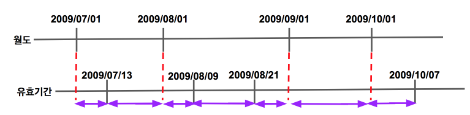

# 5주차 - 고급 조인 테크닉

여러 상황에서 효율적으로 조인을 사용하는 방법을 알아보겠습니다.

## 1. 누적매출 구하기

아래와 같은 형태의 테이블이 있다고 가정하겠습니다.


(출처 : [구루비](http://wiki.gurubee.net/pages/viewpage.action?pageId=26740935))  
  
이 테이블의 데이터에 전체매출 데이터를 포함해서 조회하고 싶습니다.


(이렇게 누적 매출이 추가되고 싶습니다.)  
  
오라클이라면 분석함수를 이용해서 해결할 수 있습니다.

```sql

select 지점, 판매월, 매출, 
        sum(매출) over(partition by 지점 order by 판매월
                    range between unbounded preceding and current row) 누적매출
from 월별지점매출
```

```partition by```는 Group by에서 집합을 뺀 기능이라고 보시면 됩니다.  
즉, 지점 단위로 잘라내기만 한 것입니다.  
  
```unbounded preceding```는 현재 윈도우의 시작 위치가 첫번째 row로 지정한 것입니다.  
  
```current row```를 통해 현재 row를 계속 가리키게 되어 row가 증가함에 따라 각 지점별/판매월의 누적 매출이 연산 됩니다.  
  
MySQL처럼 분석함수가 없다면 아래와 같이 group by로 해결할 수 있습니다.

```sql

select t1.지점, t1.판매월, min(t1.매출) as 매출, sum(t2.매출) as 누적매출
from   월별지점매출 t1, 월별지점매출 t2
where  t2.지점 = t1.지점
and    t2.판매월 <= t1.판매월
group by t1.지점, t1.판매월
order by t1.지점, t1.판매월
```

t1을 Driving Table로 두고, t2를 ```t2.지점 = t1.지점 and t2.판매월 <= t1.판매월```조건에 맞춰 조회하여 ```sum``` 하였습니다.  
  
성능은 분석함수를 사용한 경우가 훨씬더 좋지만, 1) 모든 DBMS에서 지원하지 않는점과 2) 쿼리가 조금 복잡하다는 단점이 있습니다.  

## 2. 선분 이력 끊기

앞장에서 설명했듯이, 선분이력이란 **시작일과 종료일이 별도의 컬럼으로 관리**되는것을 얘기합니다.  
만약 이 선분이력을 끊어서 조회해야한다면 어떻게 해야할까요?  
  
에를 들어 각 월의 시작일과 종료일을 저장하는 **월도**라는 테이블이 있고, 상품의 유효기간을 관리하는 **유효기간**이란 테이블이 있다고 가정하겠습니다.  
  
여기서 상품별 유효기간을 조회하되, 익월일 경우 분류된 결과가 필요하다면 어떻게 해야할까요?  
(즉, 상품 A가 시작일이 2009/07/13 ~ 2009/08/08의 유효기간이 있다면, 조회 결과는 2009/07/13 ~ 2009/07/31, 2009/08/01 ~ 2009/08/07이 됩니다.)  
  
샘플 데이터는 아래와 같습니다.  
  
**월도**

| 기준월 | 시작일자 | 종료일자 |
|:------:|:--------:|:--------:|
| 200906 | 20090601 | 20090630 |
| 200907 | 20090701 | 20090731 |
| 200908 | 20090801 | 20090831 |
| 200909 | 20090901 | 20090930 |
| 200910 | 20091001 | 20091030 |

**유효기간**

| 상품번호 | 시작일자 | 종료일자 | 데이터 |
|:------:|:--------:|:--------:|-----|
|    a   | 20090713 | 20090808 | a1  |
|    a   | 20090809 | 20090820 | a2  |
|    a   | 20090821 | 20091007 | a3  |

이 데이터들을 조건에 맞춰 조회한다는 것은 아래 그림과 같은 결과를 원하는 것입니다.



이런 조건은 한번에 작성하기가 어렵습니다.  
그래서 나눠서 진행해보겠습니다.  
첫번째로 두 테이블을 단순 조인해보겠습니다.

```sql

select 월도.기준월, 유효기간.시작일자, 유효기간.종료일자, 유효기간.상품번호, 유효기간.데이터
from 월도, 유효기간
where 유효기간.시작일자 <= 월도.종료일자
and 유효기간.종료일자 >= 월도.시작일자
order by  월도.기준월, 유효기간.시작일자

```

```유효기간.시작일자 <= 월도.종료일자 and 유효기간.종료일자 >= 월도.시작일자```를 통해 겹치는 영역에 대해 제한을 하고 두 테이블을 조인하였습니다.  

이 쿼리의 결과는 아래와 같습니다.

| 기준월 | 시작일자 | 종료일자 | 상품번호 | 데이터 |
|:--------:|:--------:|:--------:|:------:|:------:|
|  200907  | 20090713 | 20090808 |   a   |   a1   |
|  200908  | 20090713 | 20090808 |   a   |   a1   |
|  200908  | 20090809 | 20090820 |   a   |   a1   |
|  200908  | 20090821 | 20091007 |   a   |   a1   |
|  200909  | 20090821 | 20091007 |   a   |   a1   |
|  200910  | 20090821 | 20091007 |   a   |   a1   |

이런 결과가 나온 이유는 ```select 유효기간.시작일자, 유효기간.종료일자```를 사용했기 때문입니다.  
결국 올바른 결과가 나오려면, 

* 시작일은 월도와 유효기간의 시작일 중 가장 늦은 일자
* 종료일은 월도와 유효기간의 종료일 중 가장 빠른 일자 

가 되어야만 합니다.  

> 예를 들어 2009/07/13 ~ 2009/08/08의 유효기간과 2009/07/01 ~ 2009/07/31의 월도를 조합한다고 하겠습니다.  
07/13과 07/01 중 07/13이, 08/08과 07/31중엔 07/31이 되어야만 합니다. 

이를 위해 ```greatest```, ```least```를 사용하겠습니다.

```sql

select 유효기간.상품번호, 
    greatest(월도.시작일자, 유효기간.시작일자), 
    least(월도.종료일자, 유효기간.종료일자), 
    유효기간.데이터
from 월도, 유효기간
where 유효기간.시작일자 <= 월도.종료일자
and 유효기간.종료일자 >= 월도.시작일자
order by  월도.기준월, 유효기간.시작일자

```

이렇게 쿼리를 변경하고 실행하면!

| 상품번호 | 시작일자 | 종료일자 | 데이터 |
|:--------:|:--------:|:--------:|:------:|
|     a    | 20090713 | 20090731 |   a1   |
|     a    | 20090801 | 20090808 |   a1   |
|     a    | 20090809 | 20090820 |   a2   |
|     a    | 20090821 | 20090831 |   a3   |
|     a    | 20090901 | 20090930 |   a3   |
|     a    | 20091001 | 20091007 |   a3   |

원하던 결과가 조회된 것을 확인할 수 있습니다.

## 3. 데이터 복제를 통한 소계 구하기

쿼리를 작성하다 보면 데이터 복제 기법을 활용해야 할 때가 많습니다. 데이터복제를 위해 일부러 카테시안 곱(Cartesian Product)을 발생시켜 복제하거나, 복제용 테이블을 미리 만들어두고 이를 활용하기도 합니다.  
여기서는 데이터 복제 방법을 몇가지 소개드리겠습니다.  

### 3-1. 카테시안곱으로 해결

첫번째 방법은 카테시안 곱으로 해결하는 방법입니다.  
**rownum을 2개만 뽑는 쿼리와 실제 조회 쿼리를 조합**하는 것입니다.

```sql
select rownum no
from dual
connect by lelvel <= 2;

```

```sql
select id, salary, dept_id
from employee;
```

이 2쿼리를 합쳐서 카테시안 곱을 발생시킵니다.

```sql

```

## 4. 상호베타적 관계 

## 5. 최종 출력 건에 대해서만 조인하기

## 6. 징검다리 테이블 조인을 이용한 튜닝

## 7. 점이력 조회

## 8. 유효기간 조인

## 9. 유효기간 조인 튜닝

