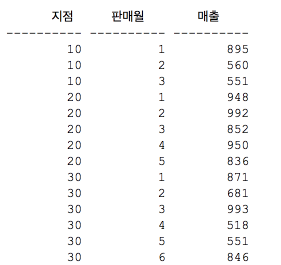
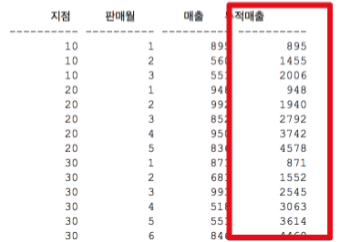
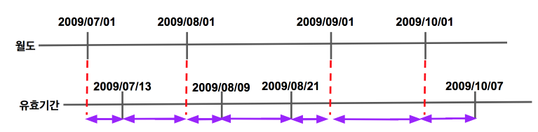
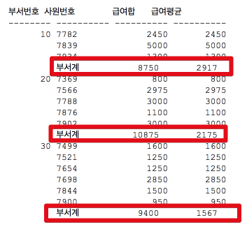
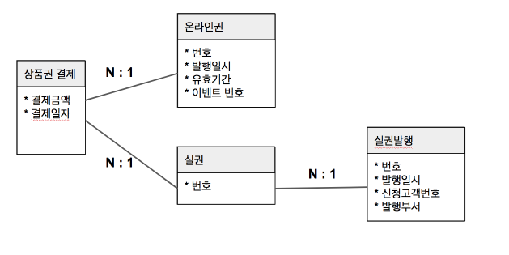

# 5주차 - 고급 조인 테크닉

여러 상황에서 효율적으로 조인을 사용하는 방법을 알아보겠습니다.

## 1. 누적매출 구하기

아래와 같은 형태의 테이블이 있다고 가정하겠습니다.



(출처 : [구루비](http://wiki.gurubee.net/pages/viewpage.action?pageId=26740935))  
  
이 테이블의 데이터에 전체매출 데이터를 포함해서 조회하고 싶습니다.



(이렇게 누적 매출이 추가되고 싶습니다.)  
  
오라클이라면 분석함수를 이용해서 해결할 수 있습니다.

```sql

select 지점, 판매월, 매출, 
        sum(매출) over(partition by 지점 order by 판매월
                    range between unbounded preceding and current row) 누적매출
from 월별지점매출
```

```partition by```는 Group by에서 집합을 뺀 기능이라고 보시면 됩니다.  
즉, 지점 단위로 잘라내기만 한 것입니다.  
  
```unbounded preceding```는 현재 윈도우의 시작 위치가 첫번째 row로 지정한 것입니다.  
  
```current row```를 통해 현재 row를 계속 가리키게 되어 row가 증가함에 따라 각 지점별/판매월의 누적 매출이 연산 됩니다.  
  
MySQL처럼 분석함수가 없다면 아래와 같이 group by로 해결할 수 있습니다.

```sql

select t1.지점, t1.판매월, min(t1.매출) as 매출, sum(t2.매출) as 누적매출
from   월별지점매출 t1, 월별지점매출 t2
where  t2.지점 = t1.지점
and    t2.판매월 <= t1.판매월
group by t1.지점, t1.판매월
order by t1.지점, t1.판매월
```

t1을 Driving Table로 두고, t2를 ```t2.지점 = t1.지점 and t2.판매월 <= t1.판매월```조건에 맞춰 조회하여 ```sum``` 하였습니다.  
  
성능은 분석함수를 사용한 경우가 훨씬더 좋지만, 1) 모든 DBMS에서 지원하지 않는점과 2) 쿼리가 조금 복잡하다는 단점이 있습니다.  

## 2. 선분 이력 끊기

앞장에서 설명했듯이, 선분이력이란 **시작일과 종료일이 별도의 컬럼으로 관리**되는것을 얘기합니다.  
만약 이 선분이력을 끊어서 조회해야한다면 어떻게 해야할까요?  
  
에를 들어 각 월의 시작일과 종료일을 저장하는 **월도**라는 테이블이 있고, 상품의 유효기간을 관리하는 **유효기간**이란 테이블이 있다고 가정하겠습니다.  
  
여기서 상품별 유효기간을 조회하되, 익월일 경우 분류된 결과가 필요하다면 어떻게 해야할까요?  
(즉, 상품 A가 시작일이 2009/07/13 ~ 2009/08/08의 유효기간이 있다면, 조회 결과는 2009/07/13 ~ 2009/07/31, 2009/08/01 ~ 2009/08/07이 됩니다.)  
  
샘플 데이터는 아래와 같습니다.  
  
**월도**

| 기준월 | 시작일자 | 종료일자 |
|:------:|:--------:|:--------:|
| 200906 | 20090601 | 20090630 |
| 200907 | 20090701 | 20090731 |
| 200908 | 20090801 | 20090831 |
| 200909 | 20090901 | 20090930 |
| 200910 | 20091001 | 20091030 |

**유효기간**

| 상품번호 | 시작일자 | 종료일자 | 데이터 |
|:------:|:--------:|:--------:|-----|
|    a   | 20090713 | 20090808 | a1  |
|    a   | 20090809 | 20090820 | a2  |
|    a   | 20090821 | 20091007 | a3  |

이 데이터들을 조건에 맞춰 조회한다는 것은 아래 그림과 같은 결과를 원하는 것입니다.



이런 조건은 한번에 작성하기가 어렵습니다.  
그래서 나눠서 진행해보겠습니다.  
첫번째로 두 테이블을 단순 조인해보겠습니다.

```sql

select 월도.기준월, 유효기간.시작일자, 유효기간.종료일자, 유효기간.상품번호, 유효기간.데이터
from 월도, 유효기간
where 유효기간.시작일자 <= 월도.종료일자
and 유효기간.종료일자 >= 월도.시작일자
order by  월도.기준월, 유효기간.시작일자

```

```유효기간.시작일자 <= 월도.종료일자 and 유효기간.종료일자 >= 월도.시작일자```를 통해 겹치는 영역에 대해 제한을 하고 두 테이블을 조인하였습니다.  

이 쿼리의 결과는 아래와 같습니다.

| 기준월 | 시작일자 | 종료일자 | 상품번호 | 데이터 |
|:--------:|:--------:|:--------:|:------:|:------:|
|  200907  | 20090713 | 20090808 |   a   |   a1   |
|  200908  | 20090713 | 20090808 |   a   |   a1   |
|  200908  | 20090809 | 20090820 |   a   |   a1   |
|  200908  | 20090821 | 20091007 |   a   |   a1   |
|  200909  | 20090821 | 20091007 |   a   |   a1   |
|  200910  | 20090821 | 20091007 |   a   |   a1   |

이런 결과가 나온 이유는 ```select 유효기간.시작일자, 유효기간.종료일자```를 사용했기 때문입니다.  
결국 올바른 결과가 나오려면, 

* 시작일은 월도와 유효기간의 시작일 중 가장 늦은 일자
* 종료일은 월도와 유효기간의 종료일 중 가장 빠른 일자 

가 되어야만 합니다.  

> 예를 들어 2009/07/13 ~ 2009/08/08의 유효기간과 2009/07/01 ~ 2009/07/31의 월도를 조합한다고 하겠습니다.  
07/13과 07/01 중 07/13이, 08/08과 07/31중엔 07/31이 되어야만 합니다. 

이를 위해 ```greatest```, ```least```를 사용하겠습니다.

```sql

select 유효기간.상품번호, 
    greatest(월도.시작일자, 유효기간.시작일자), 
    least(월도.종료일자, 유효기간.종료일자), 
    유효기간.데이터
from 월도, 유효기간
where 유효기간.시작일자 <= 월도.종료일자
and 유효기간.종료일자 >= 월도.시작일자
order by  월도.기준월, 유효기간.시작일자

```

이렇게 쿼리를 변경하고 실행하면!

| 상품번호 | 시작일자 | 종료일자 | 데이터 |
|:--------:|:--------:|:--------:|:------:|
|     a    | 20090713 | 20090731 |   a1   |
|     a    | 20090801 | 20090808 |   a1   |
|     a    | 20090809 | 20090820 |   a2   |
|     a    | 20090821 | 20090831 |   a3   |
|     a    | 20090901 | 20090930 |   a3   |
|     a    | 20091001 | 20091007 |   a3   |

원하던 결과가 조회된 것을 확인할 수 있습니다.

## 3. 데이터 복제를 통한 소계(소규모 합) 구하기

쿼리를 작성하다 보면 데이터 복제 기법을 활용해야 할 때가 많습니다. 데이터복제를 위해 일부러 카테시안 곱(Cartesian Product)을 발생시켜 복제하거나, 복제용 테이블을 미리 만들어두고 이를 활용하기도 합니다.  

예를들어 아래와 같은 쿼리결과가 필요하다고 가정해보겠습니다.  



각 사번별 급여가 노출되고, 해당 부서별 급여합이 부서마지막에 조회되어야 하는 경우입니다.  

이럴때 어떻게 **1개의 쿼리로 결과를 조회**할 수 있는지 데이터 복제 방법을 활용하는 방법을 소개드리겠습니다.  

### 3-1. 카테시안곱으로 해결

데이터 복제를 하는 가장 쉬운 방법은 카테시안 곱으로 해결하는 방법입니다.  
**rownum을 2개만 뽑는 쿼리와 실제 조회 쿼리를 조합**하는 것입니다.

```sql
select rownum no
from dual
connect by lelvel <= 2;

```

rownum을 1,2 2개를 발생시킵니다.  

```sql
select id, salary, dept_id
from employee;
```

이 2쿼리를 합쳐서 카테시안 곱을 발생시킵니다.

```sql

select b.no,
        a.dept_id as dept_id,
        a.id as emp_id,
        a.salary as salary
from employee a,
(select rownum no
from dual
connect by lelvel <= 2) b;
```

이렇게 조합할 경우 no가 1,2 2개로 employee가 각각 복사되므로 전체 내용이 2배가 됩니다.  

### 3-2. 부서별 소계로 확장

위 카테시안 곱을 사용한뒤, 복사된 데이터인 (No가 2인) 데이터들에는 emp_id 대신 **부서계**라는 이름으로 노출되도록 쿼리를 조금 수정하겠습니다.  
(추가로 무의미한 no도 제거하겠습니다.)  

```sql
select a.dept_id as dept_id,
       decode(b.no, 1, to_char(a.emp_id, 2, '부서계') 사번,
        a.salary as salary
from employee a,
(select rownum no
from dual
connect by lelvel <= 2) b;
``` 

> decode: **Oracle에서만** 사용가능하며, (컬럼, 조건, true일때 반환값, false일때 반환값) 으로 선언합니다.

위 쿼리처럼 수정하게 되면, 이제 **상단의 데이터들은 사번**을, **하단의 데이터들은 '부서계'**란 이름으로 갖게 됩니다.  
이 **부서계**가 중요합니다.  
결과적으로 서로 다른 사번이 동일한 **부서계**란 데이터로 통일 된 것인데요, 이렇게 되면 부서계 데이터를 통해 **부서별(dept_id)로 sum을 하면 부서별 합계**를 구할수 있게 됩니다.  
  
실제 쿼리를 통해 확인해보겠습니다.

```sql

select a.dept_id as dept_id,
       decode(b.no, 1, to_char(a.emp_id, 2, '부서계') 사번,
        sum(a.salary) as 급여합
from employee a,
(select rownum no
from dual
connect by lelvel <= 2) b
group by a.dept_id, b.no, decode(b.no, 1, to_char(a.emp_id, 2, '부서계')
order by 1,2;
```

이 쿼리를 수행하면 


와 같은 결과를 얻을 수 있습니다.


## 4. 상호베타적 관계 

상호배타적 관계란, 어떤 엔터티가 두 개 이상의 다른 엔터티의 **합집합과 관계**를 갖는 것을 얘기합니다.  
  
예를 들어 **온라인 상품권**과 **오프라인 상품권(실권)** 2가지의 상품권 타입(테이블)이 있으며 상품권 결제라는 테이블에선 온라인 상품권과 오프라인 상품권 모두와 관계를 맺어야만 하는 상황입니다.  



이런 상황에서 조회는 어떻게 하면 좋을지 하나씩 소개드리겠습니다.

### 4-1. 외래키 분리

첫번째 방법은 상품권결제 테이블에 **온라인권번호, 실권번호 컬럼을 추가**하는것입니다.  
즉, 각 테이블과 직접 관계를 맺는 FK를 추가하는 것입니다.  
  
실제로 사용한 쿼리는 아래와 같습니다.

```sql
SELECT a.주문번호, a.결제일자, a.결제금액
        , NVL(b.온라인권번호, c.실권번호) 상품권번호
        , NVL(b.발행일시, d.발행일시) 발행일시
FROM 상품권결제 a, 온라인권 b, 실권 c, 실권발행 d
WHERE a.결제일자 BETWEEN :dt1 AND :dt2
AND b.온라인권번호(+) = a.온라인권번호 -- outer 조인
AND c.실권번호(+) = a.실권번호 -- outer 조인
AND d.발행번호(+) = c.발행번호;
```

### 4-2. 외래키 통합

두번째 방법은 첫번째와 달리 상품권 테이블마다 FK를 분리하는 방식이 아닌, 두 FK를 합쳐 통합된 FK를 두는 방식입니다.  
  
즉, **상품권 번호 구분(온라인권, 실권)과 상품권번호** 라는 컬럼을 추가하는 것입니다.  
(상품권 번호 구분 컬럼은 1일땐 온라인권을, 2일땐 실권이라 가정하겠습니다.)  

```sql
SELECT x.주문번호, x.결제일자, x.결제금액, y.온라인권번호 상품권번호, y.발행일시
FROM 상품권결제 x, 온라인권 y
WHERE x.상품권구분 = '1' 
AND x.결제일자 BETWEEN :dt1 AND :dt2
AND y.온라인권번호(+) = x.상품권번호
UNION ALL
SELECT x.주문번호, x.결제일자, x.결제금액, y.실권번호 상품권번호, z.발행일시
FROM 상품권결제 x, 실권 y, 실권발행 z
WHERE  x.상품권구분 = '2'  
AND x.결제일자 BETWEEN :dt1 AND :dt2
AND y.실권번호(+) = x.상품권번호
AND z.발행번호(+) = y.발행번호;
```

```union all```을 사용했기 때문에 위아래로 2번 수행되지만, 인덱스에 따라 처리 방식이 다릅니다.

1. (상품권구분 + 결제일자) : 읽는 범위 중복 없음
2. (결제일자 + 상품권구분) : 인덱스 스캔범위에 중복 발생
3. (결제일자) : 상품권구분을 필터링하기 위한 테이블 Random 액세스까지 중복 발생

```y.온라인권번호(+) = x.상품권번호``` 와 ```AND y.실권번호(+) = x.상품권번호```의 차이로 unionall을 사용할 수 밖에 없고, 그로인해 중복조회가 발생하고 있습니다.  
이를 한번의 조회로 변경하게 되면 이런 중복이 제거됩니다.  
쿼리를 개선해보겠습니다.

```sql
SELECT /*+ ordered use_nl(b) use_nl(c) use_nl(c) use_nl(d) */
       a.주문번호, a.결제일자, a.결제금액
        , NVL(b.온라인권번호, c.실권번호) 상품권번호
        , NVL(b.발행일시, d.발행일시) 발행일시
FROM 상품권결제 a, 온라인권 b, 실권 c, 실권발행 d
WHERE a.결제일자 BETWEEN :dt1 AND :dt2
AND b.온라인권번호(+) = DECODE(a.상품권구분, '1',  a.상품권번호) -- union all 대신, decode & outer join을 통해 1개의 조건문으로 해결 
AND c.실권번호(+) = DECODE(a.상품권구분, '2',  a.상품권번호)
-- union all 대신, decode & outer join을 통해 1개의 조건문으로 해결
AND d.발행번호(+) = c.발행번호;
```

주석을 보시면 아시겠지만, decode와 outer join을 통해 **온라인권과 실권번호 모두 조건절안에 담을 수 있게** 되었습니다.  
즉, 1번의 스캔으로 양 테이블을 모두 가져올 수 있게 되어 비효율이 제거 되었습니다.

## 5. 최종 출력 건에 대해서만 조인하기

아래와 같이 게시판을 조회하는 쿼리가 있다고 가정하겠습니다.  
(일반적으로 )
```sql
-- (3)
SELECT *
FROM (
    -- (2)
    SELECT ROWNUM NO, 등록일자, 번호, 제목, 회원명, 게시판유형명, 질문유형명, COUNT(*) OVER() CNT
    FROM(
        -- (1) 
        SELECT A.등록일자, A.번호, A.제목, B.회원명, C.게시판유형명, D.질문유형명
        FROM 게시판 A, 회원 B, 게시판유형 C, 질문유형 D
        WHERE A.게시판유형 = :TYPE
        AND     B.회원번호 = A.작성자번호
        AND     C.게시판유형 = A.게시판유형
        AND     D.질문유형 = A.질문유형
        ORDER BY A.등록일자 DESC, A.질문유형, A.번호
        )
    WHERE ROWNUM <= 31
    )
WHERE NO BETWEEN 21 AND 30
```

이 쿼리가 수행되는 환경은 아래와 같습니다.

* 전체 게시판 수 : 수백만
* 특정 게시판 수 : 10만건 
  * (1) select 쿼리 결과
* 4개의 테이블 조인
* 정렬 : 등록일자, 질문유형, 번호
* 인덱스 : 게시판 유형 + 등록일자 desc + 번호

3개의 select 쿼리를 보면 몇가지 비효율이 있습니다.  

1. 10만건 조회
2. 4개의 테이블 조인
3. sort 과정에서 stopkey 발생

이런 비효율을 하나씩 개선하겠습니다.  

### 5-1. 인덱스에 질문 유형 추가

처음 개선할 것은 10만건 조회부분입니다.  

```sql
where A.게시판유형 = :TYPE
AND     B.회원번호 = A.작성자번호
AND     C.게시판유형 = A.게시판유형
AND     D.질문유형 = A.질문유형
```

위 조회조건을 보시면 A.질문유형은 인덱스(```게시판 유형 + 등록일자 desc + 번호```)에 포함되지 않아 조회시 결국 테이블 접근이 필요합니다.  
여기에 인덱스에 A.질문유형을 추가하여 인덱스를 ```게시판 유형 + 등록일자 desc + 번호 + 질문유형```으로 변경하면 조건에 해당하는 row는 **인덱스만으로** 조회할 수 있게 됩니다.  
  
단, 여기서 주의하실 점은 **(1) 쿼리의 출력 컬럼은 rowid 하나**여야 한다는 것입니다.  
인덱스 컬럼 외 컬럼을 결과물로 전달하기 위해선 결국 테이블 접근이 필요하기 때문입니다.  
그래서 (1) 쿼리는 아래와 같이 변경이 필요합니다.

```sql
SELECT ROWID RID
FROM 게시판
WHERE 게시판유형 = :TYPE
ORDER BY 등록일자 DESC, 질문유형, 번호
```

자 그럼 여기서 한가지 궁금한 점이 생깁니다.  
실제 **조인 테이블들의 데이터들은 어떻게 조회**할 것이냐 입니다.  
  
이들 컬럼은 페이지 처리가 모두 완료되어 **최종 결과집합으로 확정된 10건에 대해서만 액세스**하면 됩니다.  
그걸 위해 (1) 쿼리의 결과를 rowid만으로 한정한 것입니다.  
그래서 최종 쿼리는 아래와 같습니다.

```sql
SELECT /*+ ORDERED USE_NL(A) USE_NL(B) USE_NL(C) USE_NL(D) ROWID(A) */
       A.등록일자, B.번호, A.제목, B.회원명, C.게시판유형명, D.질문유형명, X.CNT
FROM (
        SELECT RID, ROWNUM NO, COUNT(*) OVER() CNT
        FROM (
                SELECT ROWID RID
                FROM 게시판
                WHERE 게시판유형 = :TYPE
                ORDER BY 등록일자 DESC, 질문유형, 번호
                )
        WHERE ROWNUM <= 31
        ) X, 게시판 A, 회원 B, 게시판유형 C, 질문유형 D
WHERE X.NO BETWEEN 21 AND 30
AND A.ROWID = X.RID
AND B.회원번호 = A.작성자번호
AND C.게시판유형 = A.게시판유형
AND D.질문유형 = A.질문유형
```

