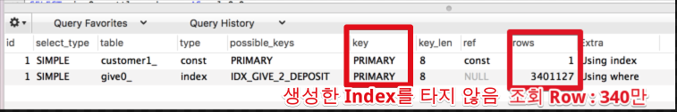
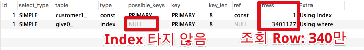
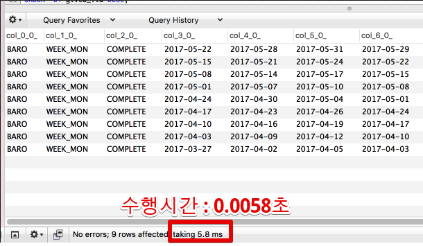
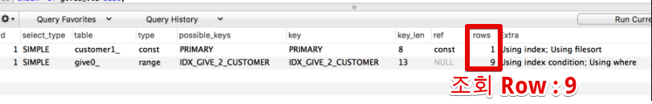

# Range 인덱스

범위 조회시 인덱스를 어떻게 작성하는지 좋을지 실험해보았습니다.

## 테스트 환경

테스트할 쿼리의 테이블 관계도입니다.


Customer와 Give가 1:N 관계이지만, 조회의 중심은 Give인 상황입니다.  
추가로 **Give는 수백만**, **Customer는 약 10만**의 데이터가 있다고 하겠습니다.  
좀 더 명확한 비교를 위해 **둘 사이의 FK는 제거**한 상태이며, 순수하게 아래 제공하는 인덱스들만 등록하여 테스트하였습니다.  
(Give 테이블은 temp_give라는 임시테이블로 복사하여 사용하였습니다.)  
  
아래는 조회시 사용되는 컬럼들의 Cardinality (유니크한 값의 개수)입니다.

* settle_code : 2 
* customer_id : 약 10만 (Customer 테이블의 Row수)
* deposit_due_date : 약 1,000 (2015년 ~ 현재까지)

## 인덱스 비교 1 

첫번째 비교 대상은 customer_id, deposit_due_date 컬럼을 사용한 조회 쿼리입니다.  
실제 사용한 쿼리는 아래와 같습니다.

```sql
SELECT give0_.settle_code     AS col_0_0_, 
       give0_.give_cycle_code AS col_1_0_, 
       give0_.status          AS col_2_0_, 
       give0_.start_date      AS col_3_0_, 
       give0_.end_date        AS col_4_0_, 
       give0_.deposit_date    AS col_5_0_, 
       give0_.cycle_date      AS col_6_0_, 
       give0_.fix_fee         AS col_7_0_, 
       give0_.order_amount    AS col_8_0_, 
       give0_.deduct_amount   AS col_9_0_, 
       give0_.rate_fee        AS col_10_0_, 
       give0_.vat             AS col_11_0_, 
       give0_.give_amount     AS col_12_0_, 
       give0_.bond_amount     AS col_13_0_, 
       give0_.add_amount      AS col_14_0_ 
FROM   temp_give give0_ 
       INNER JOIN customer customer1_ 
               ON give0_.customer_id = customer1_.id 
WHERE  give0_.customer_id =43209 
       AND ( give0_.deposit_due_date BETWEEN 20170401 AND 20170720 ) 
ORDER  BY give0_.id DESC;

```

## 인덱스별 결과

### 1. deposit_due_date, customer_id

사용한 인덱스

```sql
create index IDX_GIVE_2_DEPOSIT on temp_give (deposit_due_date, customer_id);
```

실제 조회  
  


실행 계획



### 2. customer_id, deposit_due_date

사용한 인덱스

```sql
create index IDX_GIVE_2_CUSTOMER on temp_give (customer_id, deposit_due_date);
```

실제 조회
  


실행 계획


### 3. settle_code, deposit_due_date, customer_id

사용한 인덱스

```sql
create index IDX_GIVE_3_DEPOSIT on temp_give (settle_code, deposit_due_date, customer_id);
```

실제 조회


실행 계획




### 4. settle_code, customer_id, deposit_due_date

사용한 인덱스

```sql
create index IDX_GIVE_3_CUSTOMER on temp_give (settle_code, customer_id, deposit_due_date);
```

실제 조회


### 결과 1

```sql
give0_.customer_id =43209 
       AND ( give0_.deposit_due_date BETWEEN 20170401 AND 20170720 ) 
```

라는 조회 조건에서 가장 성능이 좋았던 인덱스는 ```customer_id, deposit_due_date``` (0.008초)였습니다.  
그외 다른 인덱스들은 모두 4초에 가까운 결과를 보여주었습니다.  
특히 1번의 사례를 보면 조건절에 사용한 컬럼을 인덱스에 동일하게 구성하였지만 전혀 인덱스를 사용하지 못한것을 확인하였습니다.  
즉, 2주차때 익힌 내용대로 **범위조건의 인덱스 컬럼(```deposit_due_date```) 의 다음 인덱스 컬럼들은 전혀 인덱스 효과가 없었습니다**.  

## 인덱스 비교 2 

두번째 비교 대상은 settle_code, customer_id, deposit_due_date 컬럼을 사용한 조회 쿼리입니다.  
(1번째 실험의 조건에서 settle_code가 추가된 것입니다.)  

실제 사용한 쿼리는 아래와 같습니다.

```sql
SELECT give0_.settle_code     AS col_0_0_, 
       give0_.give_cycle_code AS col_1_0_, 
       give0_.status          AS col_2_0_, 
       give0_.start_date      AS col_3_0_, 
       give0_.end_date        AS col_4_0_, 
       give0_.deposit_date    AS col_5_0_, 
       give0_.cycle_date      AS col_6_0_, 
       give0_.fix_fee         AS col_7_0_, 
       give0_.order_amount    AS col_8_0_, 
       give0_.deduct_amount   AS col_9_0_, 
       give0_.rate_fee        AS col_10_0_, 
       give0_.vat             AS col_11_0_, 
       give0_.give_amount     AS col_12_0_, 
       give0_.bond_amount     AS col_13_0_, 
       give0_.add_amount      AS col_14_0_ 
FROM   temp_give give0_ 
       INNER JOIN customer customer1_ 
               ON give0_.customer_id = customer1_.id 
WHERE  give0_.settle_code = 'BARO' 
        AND give0_.customer_id =43209 
       AND ( give0_.deposit_due_date BETWEEN 20170401 AND 20170720 ) 
ORDER  BY give0_.id DESC;

```

인덱스들은 1번째 실험과 동일하게 4개를 사용하였습니다.

### 1. deposit_due_date, customer_id

사용한 인덱스

```sql
create index IDX_GIVE_2_DEPOSIT on temp_give (deposit_due_date, customer_id);
```

실제 조회


실행 계획


### 2. customer_id, deposit_due_date

사용한 인덱스

```sql
create index IDX_GIVE_2_CUSTOMER on temp_give (customer_id, deposit_due_date);
```

실제 조회



실행 계획



### 3. settle_code, deposit_due_date, customer_id

사용한 인덱스

```sql
create index IDX_GIVE_3_DEPOSIT on temp_give (settle_code, deposit_due_date, customer_id);
```

실제 조회


실행 계획


### 4. settle_code, customer_id, deposit_due_date

사용한 인덱스

```sql
create index IDX_GIVE_3_CUSTOMER on temp_give (settle_code, customer_id, deposit_due_date);
```

실제 조회


실행 계획


### 결과 2

2번째 비교에선 2개의 인덱스가 좋은 성능을 보여주었습니다.  

* ```customer_id, deposit_due_date```
* ```settle_code, customer_id, deposit_due_date```

재밌는 것은 3번째 인덱스인데요

## 인덱스 비교 3

자 그럼 여기서 몇가지 의문이 생깁니다.  
만약 

* **customer_id가 조회 조건에서 빠지면** 어떻게 될까요? 
* **deposit_due_date만 인덱스를 생성**하면 어떻게 될까요?


#### 5. customer_id가 조회조건에 없을 경우 1

## 주의사항

위 결과를 보고 인덱스를 확정짓고 관리하지 않으면 위험합니다.  
테이블의 Row와 컬럼의 분포도는 결국 **시간이 지나면서 변하기 때문**입니다.  
